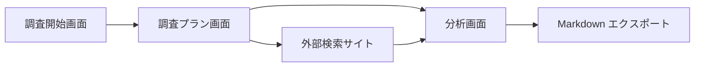

# 画面設計

## 1. 設計方針

本サイトは、説明を読むためのサイトではなく、すぐに調査を始める業務ツールとして設計する。

画面上の主役は「入力」「生成結果」「次の行動」である。特許の専門用語を知らないユーザーでも迷わないよう、専門用語は必要な箇所だけに出し、各出力には短い理由を添える。

## 2. 情報設計

MVP では、以下の 3 画面を中心に構成する。

| 画面 | 目的 | 主な操作 |
| --- | --- | --- |
| 調査開始画面 | アイデアを入力する | 調査テーマ入力、AI 生成開始 |
| 調査プラン画面 | 検索語と調査軸を確認する | 検索リンクを開く、検索式をコピー |
| 分析画面 | 見つけた特許を整理する | 請求項貼り付け、構成要素分解、回避案生成 |

## 3. 画面遷移

## 4. 調査開始画面

### 4.1 目的

ユーザーが事業・製品アイデアを自然文で入力し、AI による調査プラン生成を開始する。

### 4.2 レイアウト

- 左側または上部に入力フォーム
- 右側または下部に入力例
- 画面下部に短い免責表示
- 主ボタンは「調査プランを作成」

### 4.3 入力フォーム

| ラベル | 入力形式 | 必須 | プレースホルダー |
| --- | --- | --- | --- |
| 機能概要 | textarea | 必須 | 例: スマートフォンのカメラ映像から作業者の危険姿勢を検出する |
| 解決したい課題 | textarea | 推奨 | 例: 作業現場で転倒や腰痛につながる姿勢を早期に警告したい |
| 利用シーン・業界 | text | 推奨 | 例: 建設現場、物流倉庫、介護施設 |
| 部品・技術 | textarea | 任意 | 例: カメラ、姿勢推定 AI、スマートフォン通知、振動アラート |
| 競合製品・企業 | textarea | 任意 | 例: 類似アプリ、ウェアラブル安全管理サービス |

### 4.4 バリデーション

- 機能概要が未入力の場合は生成できない
- 機能概要が短すぎる場合は、何を入力すべきかをフォーム内で促す
- 未公開発明を含む可能性があるため、送信前に AI 利用に関する注意を表示する

### 4.5 状態

| 状態 | 表示 |
| --- | --- |
| 初期 | 入力例とフォーム |
| 入力中 | 保存前であることを控えめに表示 |
| 生成中 | 「調査軸を分解しています」などの進行文 |
| エラー | 再試行ボタンと、入力内容が失われていないことの表示 |

## 5. 調査プラン画面

### 5.1 目的

AI が生成したキーワード、検索式、調査軸を確認し、外部検索サイトへ移動する。

### 5.2 セクション

| セクション | 内容 | 操作 |
| --- | --- | --- |
| 調査サマリー | 入力内容の要約、前提条件 | 編集に戻る |
| キーワード | 日本語、英語、類義語、機能的表現、作用語 | コピー、採用、除外 |
| 調査軸 | 技術、課題、用途、競合、分類観点 | 検索式へ反映 |
| 検索リンク | Google Patents、J-PlatPat、Espacenet | 新規タブで開く |
| チェックリスト | 次に確認すべき項目 | 完了チェック |

### 5.3 キーワード表示

キーワードは単なるタグではなく、以下の情報を持つ。

| 項目 | 例 |
| --- | --- |
| 表示語 | 姿勢推定 |
| 種別 | 技術語 |
| 英語 | pose estimation |
| 理由 | カメラ画像から人の骨格・姿勢を推定する技術領域に該当するため |
| 検索採用 | true / false |

### 5.4 検索リンク表示

各サイトごとに、目的と検索式を見せる。

| サイト | 表示例 |
| --- | --- |
| Google Patents | 「技術語で広く見る」 |
| J-PlatPat | 「日本国内の権利状態を確認する」 |
| Espacenet | 「海外出願を含めて見る」 |

検索式は編集可能にする。AI の提案をそのまま使うより、ユーザーが現場の言葉で微調整できる方が実務に合う。

## 6. 分析画面

### 6.1 目的

外部検索サイトで見つけた特許情報を貼り付け、構成要素と自社アイデアの対応を整理する。

### 6.2 入力

| ラベル | 入力形式 | 用途 |
| --- | --- | --- |
| 特許番号・公開番号 | text | メモとエクスポート用 |
| 出願人 | text | 競合分析用 |
| 要約 | textarea | 概要把握 |
| 請求項 | textarea | 構成要素分解 |
| 気になる点 | textarea | ユーザーの仮説を残す |

### 6.3 分析結果

| セクション | 内容 |
| --- | --- |
| 構成要素分解 | 請求項を要素ごとに分ける |
| 対応表 | 自社アイデアが各要素に対応するかを整理する |
| 確認メモ | 不明点、原典確認点、専門家相談点 |
| 回避設計案 | 削除、置換、順序変更、用途限定など |

### 6.4 対応表の判定ラベル

法的判断に見えないよう、ラベルは慎重にする。

| ラベル | 意味 |
| --- | --- |
| 要確認 | 対応している可能性があり、専門家確認が必要 |
| 低そう | 現時点の入力では対応が弱そう |
| 不明 | 入力情報だけでは判断できない |
| 対象外かも | 用途、構成、前提が異なる可能性がある |

「侵害」「非侵害」というラベルは使わない。

## 7. Markdown エクスポート

エクスポートには以下を含める。

- 調査タイトル
- 入力内容
- 生成キーワード
- 検索式
- 外部検索リンク
- 調査チェックリスト
- 貼り付けた特許情報
- 構成要素分解
- 対応表
- 回避設計案
- 専門家に相談すべき論点
- 生成日時

## 8. UI 文言

### 8.1 免責表示

短い表示:

> このツールは特許調査の観点整理を支援するもので、法的判断や鑑定を提供するものではありません。

詳細表示:

> AI の出力は検索語、調査軸、確認項目の提案です。権利の有効性、侵害有無、実施可否については、必ず原典を確認し、必要に応じて弁理士・弁護士などの専門家にご相談ください。

### 8.2 ボタン文言

| 操作 | 文言 |
| --- | --- |
| AI 生成 | 調査プランを作成 |
| 検索式コピー | 検索式をコピー |
| 外部リンク | Google Patents で開く |
| 分析開始 | この特許を分析する |
| エクスポート | Markdown で出力 |

## 9. MVP で作らない UI

- パテントマップ
- 図面ビューア
- PDF アップロード解析
- チームコメント
- 有料会員の管理画面
- 詳細な案件ステータス管理

